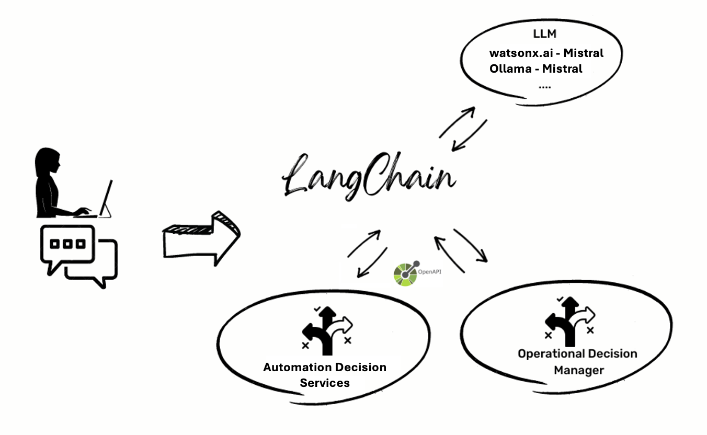

# watsonx-NeuroSymbolic-Decision Framework

Welcome to the **watsonx-NeuroSymbolic-Decision** framework! This repository provides a robust, extensible platform for integrating the generative power of Large Language Models (LLMs)—notably IBM’s watsonx.ai or open-source alternatives—with the precision, explainability, and compliance of symbolic reasoning systems, including business rule engines and ontology reasoners.

The core idea is to leverage both:

1. **Neural pattern recognition** (LLMs) for flexible natural-language understanding and generation.
2. **Symbolic deduction** (rules, ontologies) for accurate, governed, and auditable decision-making.

Together, these capabilities enable intelligent applications where natural-language user queries drive complex, compliant decision processes grounded in formal knowledge.

---

## 🚀 Key Features

- **Neuro-Symbolic Agent** (`neuro-symbolic-agent` folder): Orchestrates conversations, tool selection, parameter extraction, symbolic invocation, and response composition. Connectors support:
  - **LLM backends:** IBM watsonx.ai, Ollama (local), or other models.
  - **Rule engines:** IBM Operational Decision Manager (ODM), Automation Decision Services (ADS).
  - **Ontology reasoners:** OWL ontologies with HermiT, Pellet, FaCT++, and additional plug‑ins.
- **Decision Services** (`decision_services/`): Sample IBM ODM/ADS rule projects (e.g., HR VacationDays) with build and deployment scripts.
- **Ontology Components** (`symbolic_components/ontologies/`): Reference OWL files, SPARQL queries, and reasoner configurations.
- **Chatbot Frontend** (`chatbot-frontend/`): React-based UI for natural-language interaction demonstration.
- **Data & Examples** (`data/`): Pre-packaged decision-app archives (JARs), PDFs, sample input files.
- **Containerization**: Docker Compose setup to launch ODM/ADS, Neuro-Symbolic Agent, and Frontend in a single topology.
- **Extensibility**: Easily add new connectors, decision services, ontologies, or custom symbolic systems.

---

## 📁 Repository Structure

```
watsonx-NeuroSymbolic-Decision/
├── .gitignore
├── ads.env                     # ADS environment template
├── docker-compose.yml         # Container orchestration
├── LICENSE                    # Apache 2.0 license
├── ollama.env                 # Ollama local-LLM template
├── README.md                  # This comprehensive guide
├── README_ADS.md              # ADS-specific setup notes
├── README_EXTEND.md           # Extension guide
├── README_LOCAL.md            # Local dev instructions
├── README_NEUROSYMBOLIC.md    # Neuro-Symbolic design notes
├── README_WATSONX.md          # Watsonx.ai integration guide
├── start-ollama.sh            # Helper to launch Ollama
├── chatbot-frontend/          # React chatbot UI
│   └── ...
├── data/                      # Sample decision-app data (JARs, PDFs)
│   └── ...
├── decision_services/         # IBM ODM/ADS rule projects and scripts
│   └── ...
├── symbolic_components/       # Ontologies and tool descriptors
│   └── ontologies/
│       └── ...
└── neuro-symbolic-agent/      # Core Python backend (formerly rule-agent)
    ├── CreateLLM.py           # LLM connector factory
    ├── CreateLLMWatson.py     # Watsonx.ai integration
    ├── CreateLLMOllama.py     # Ollama integration
    ├── ODMService.py          # Rule service invocation
    ├── main.py                # Entrypoint for local Python dev
    ├── requirements.txt       # Python dependencies
    └── modules/
        ├── ontology_engine.py # OWL loading & reasoning
        ├── ml_model.py        # Optional ML components
        ├── evaluation.py      # Scoring, validation
        └── prompt_handler.py  # Parameter extraction logic
```

---

## 🎓 Framework Architecture

This framework generalizes the original [rule-based-llms](https://github.com/DecisionsDev/rule-based-llms) project into a full neuro-symbolic decision platform. A typical request flow:

1. **User Interaction**: The user submits a query via the frontend chatbot.
2. **LLM Orchestration**: The Neuro-Symbolic Agent uses an LLM to interpret intent.
3. **Component Identification**: The agent decides whether to call a decision service, ontology reasoner, or simply respond directly.
4. **Parameter Extraction**: The LLM extracts structured inputs (e.g., dates, amounts, domain entities).
5. **Symbolic Execution**:
   - **Decision Services**: Invokes IBM ODM/ADS for business-rule evaluation.
   - **Ontology Reasoners**: Loads OWL ontologies and runs HermiT/Pellet to infer new facts or check consistency.
   - **Custom Tools**: Plug in additional symbolic systems as needed.
6. **Response Generation**: The LLM composes a final, coherent answer incorporating symbolic outputs.

<details>
<summary>Conceptual Architecture Diagram</summary>



</details>

---

## 🛠️ Prerequisites

- **OS**: macOS (Intel/M1) or Windows 11 (with WSL2).
- **Docker & Docker Compose**: For containerized deployment.
- **Java 11+**: Required by IBM ODM/ADS and OWL reasoners.
- **Git**: To clone the repo.
- **Python 3.11+** (optional): For local development of the Neuro-Symbolic Agent.

### Windows (WSL2) Setup

1. Install & enable WSL2: https://learn.microsoft.com/windows/wsl/install
2. Install Rancher Desktop and configure WSL2 backend: https://rancherdesktop.io/docs
3. Ensure Docker Compose is accessible in WSL shell: `docker compose version`.

---

## ⚙️ Configuration

### Choose Your LLM Backend

#### 1. Watsonx.ai (Recommended)

1. **Create IBM Cloud & Watsonx.ai service**. Follow:
   https://dataplatform.cloud.ibm.com/docs/content/wsj/getting-started/overview-wx.html
2. **Generate API Key**: `Profile & Settings → API keys`.
3. **Note Project ID** from `Manage → General → Details`.
4. **Clone Repo**:
   ```bash
   git clone https://github.com/ruslanmv/watsonx-NeuroSymbolic-Decision.git
   cd watsonx-NeuroSymbolic-Decision
   ```
5. **Copy & Edit Env**:
   ```bash
   cp watsonx.env .env
   ```
   Fill in:
   ```text
   WATSONX_APIKEY=<your key>
   WATSONX_PROJECT_ID=<your project id>
   WATSONX_URL=<region URL>
   USE_ONTOLOGY_REASONER=1
   ONTOLOGY_PATH=symbolic_components/ontologies/your_ontology.owl
   ```

#### 2. Ollama (Local LLM)

1. Install Ollama: https://ollama.ai/download
2. Pull a model:
   ```bash
   ollama pull mistral
   ```
3. Clone Repo & Edit Env:
   ```bash
   cp ollama.env .env
   ```
   Default variables usually suffice (`OLLAMA_URL=http://localhost:11434`).

---

## 🚀 Running the Demo (Docker)

1. Ensure `.env` is configured.
2. Build & start:
   ```bash
   docker compose build
   docker compose up
   ```
3. Navigate to http://localhost:8080
4. Interact with the chatbot to invoke decision services or ontology queries.

---

## 💡 Neuro‑Symbolic Capabilities in Action

### Decision Service Example (HR VacationDays)

- **Query**: “If Jane joined on 2020-06-15, how many vacation days does she get?”
- **Flow**:
  1. LLM maps to `VacationDays` tool.
  2. Extracts `hireDate=2020-06-15`.
  3. Calls ODM/ADS rule service.
  4. Returns precise result (e.g., `20 days`).
  5. LLM crafts the natural-language response.

### Ontology Reasoning Example

- **Query**: “List all courses that are prerequisites for Advanced AI.”
- **Flow**:
  1. Agent loads `AI_Courses.owl`.
  2. Runs reasoner to infer prerequisite hierarchy.
  3. Returns structured list, then LLM formats into prose.

---

## 🔧 Extending the Framework

1. **Add Decision Services**:
   - Place rule projects under `decision_services/`.
   - Add tool descriptor JSON for each service.

2. **Add Ontologies**:
   - Drop OWL files into `symbolic_components/ontologies/`.
   - Update `.env` with new paths and enable flags.

3. **Custom Connectors**:
   - Implement connector classes in `neuro-symbolic-agent/modules/`.
   - Register in `main.py` tool registry.

4. **Frontend Enhancements**:
   - Modify `chatbot-frontend/src` React components.
   - Update UI assets in `public/`.

Detailed guidance in `README_EXTEND.md` and component‑level READMEs.

---

## 🧪 Local Python Development

```bash
python3 -m venv .venv
source .venv/bin/activate
pip install --upgrade pip
pip install -r neuro-symbolic-agent/requirements.txt
cd neuro-symbolic-agent
python main.py
``` 
Ensure same `.env` variables are present in your shell.

---

## ❓ FAQ & Troubleshooting

- **Memory OOM**: Increase Docker RAM, or prune unused images (`docker system prune -a`).
- **`docker-compose` missing**: Use `docker compose` with space.
- **Java errors**: Confirm Java 11+ in `PATH` for reasoners.
- **LLM timeouts**: Check network and service status, adjust timeouts in `.env`.

