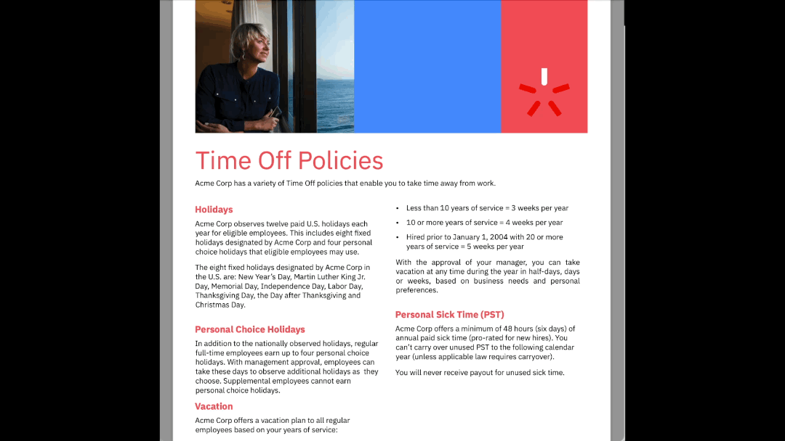

# Rule-based LLMs

This project demonstrates the integration of Large Language Models (LLMs) with a rule engine.

For an in-depth understanding, refer to [this presentation](doc/Rule-based LLMs%20Presentation.pptx) and [this video](doc/Rule-based%20LLMs%20Video.mp4).

This solution features a chatbot powered by an LLM that interacts with rule-based Decision Services.

When a user's question can be resolved through an existing Decision Service, the LLM provides the necessary parameters to call the service and uses the result to answer the query.


We are using [IBM Operational Decision Manager](https://www.ibm.com/products/operational-decision-manager) and [IBM Automation Decision Services](https://www.ibm.com/products/automation-decision-services) to demonstrate rule-based decision services.

### Sub-projects:
- **rule-agent**: A Python-based implementation of the chatbot backend using Langchain.
- **decision-services**: A collection of sample IBM ODM and IBM ADS decision services.
- **chatbot-frontend**: A React-based web application that interfaces with the chatbot backend.

See dedicated READMEs in all sub-projects.

---

# Running the Demo Application

A demo application (HR Service) showcases the system’s capabilities. Follow the instructions below to run the demo and explore the integration.



---

## Prerequisites

Ensure your system meets the requirements and all dependencies are installed.

This demo has been successfully tested on macOS M1 and Windows 11 using Rancher Desktop. We strongly recommend using these configurations.

- **Docker**
  - [Install Rancher Desktop on macOS](https://docs.rancherdesktop.io/getting-started/installation#macos)
  - [Install Rancher Desktop on Windows](https://docs.rancherdesktop.io/getting-started/installation#windows)
- **docker-compose**: Installed automatically with Rancher Desktop.
- **git**

---

### Setup Instructions for Windows OS with Rancher

1. To run the demonstration on Windows, you'll need to enable [WSL (Windows Subsystem for Linux)](https://learn.microsoft.com/en-us/windows/wsl/install).
2. Once WSL is enabled, configure Rancher Desktop to support it:


## Setting up your Environment for the Demonstration

You can run this demonstration using two different LLM configurations and, depending on your setup, follow the respective guide below:

1. [Running with Ollama (Local)](README_LOCAL.md) using [Ollama](https://ollama.com/), where the LLM runs directly on your machine.
2. [Running with Watsonx.ai (Cloud)](README_WASTONX.md) using [Watsonx.ai](https://www.ibm.com/watsonx), accessing IBM's AI models in the cloud.


### Launch the Docker Topology

1. **Open a New Terminal**  
   - On **Windows**: Open a Command Prompt and run the `wsl` command to start the Windows Subsystem for Linux (if applicable).  
   - On **macOS/Linux**: Open a terminal.

2. **Log In to Docker**  
   - To access Docker images, ensure you are logged in. Run the following command in your terminal:  
     ```bash
     docker login
     ```  
   - If you do not have a Docker account, [create one](https://hub.docker.com/signup).

> Docker enforces download rate limits for unauthenticated users. Logging in ensures you can pull images without interruptions, which is especially important for this demonstration.

3. **Build the Docker Demonstration**
   ```bash
   docker-compose build
   ```
   Once the build process completes,

4. **Run the Demonstration**
   ```bash
   docker-compose up
   ```
   This will run the ODM for Developers docker images in conjunction with the sample web application.
   
5. Wait a few minutes until you see the message `* Running on all addresses (0.0.0.0)`.
6. Now that the demo is set up, you're ready to use it. For further instructions on how to interact with the demo, please refer to the [Usage Guide](#using-the-chatbot-ui).

> **Notes:**  
> - If you are already running ODM somewhere, set the following environment variables:
>   ```sh
>   export ODM_SERVER_URL=<ODM Runtime URL>
>   export ODM_USERNAME=<ODM user, default odmAdmin>
>   export ODM_PASSWORD=<ODM user password, default odmAdmin>
>   ```
>   And change the docker-compose.yml file accordingly.
>
> - To run this demonstration with ADS instead of Operational Decision Manager, see [README_ADS.md](README_ADS.md).


## Neuro Symbolic Feature

**New Feature:**  
The latest update integrates a Neuro Symbolic pipeline into the project. This advanced module augments the original NL → JSON pipeline with:
- **Ontology-based Reasoning:**  
  An OWL ontology defines domain knowledge (e.g., engine types, components, and relationships) and is managed via `rule-agent/neuro_symbolic/ontology_engine.py`.
- **ML-Based Logical Form Mapping:**  
  Training data is generated from the ontology and used to train a Logistic Regression model (see `rule-agent/neuro_symbolic/ml_model.py`) to convert natural language input into structured logical forms.
- **Evaluation and Prompt Handling:**  
  Logical forms are evaluated against the ontology (using functions in `rule-agent/neuro_symbolic/evaluation.py`) with detailed human-readable feedback. Enhanced prompt templates (in `rule-agent/neuro_symbolic/prompt_handler.py` and `prompts.py`) are then used to generate refined responses.

To enable this feature, set the environment variable `USE_NEURO_SYMBOLIC=1` in your `.env` file or system environment.

For more details on setup and usage of the Neuro Symbolic feature, please refer to [README_NEUROSYMBOLIC.md](README_NEUROSYMBOLIC.md).


## Demo Walkthrough: Chatbot and Rule-based Decision Services

Once the Docker setup is complete, access the chatbot web application at [http://localhost:8080](http://localhost:8080).

In the chatbot, you can ask questions that will be answered by combining the capabilities of the underlying LLM and the rule-based decision services.

The chatbot can answer questions in two modes:
- **LLM-only:** The answer is generated purely by the LLM, possibly augmented with policy documents via Retrieval-Augmented Generation (RAG).
- **Decision Services Mode:** If you activate the "Use Decision Services" toggle, the chatbot will query registered Decision Services instead of relying on policy documents.

### Demo Scenario: HR Service Example

With the pre-packaged HR Service application, you can ask the following example question:

```
John Doe is an Acme Corp employee who was hired on November 1st, 1999. How many vacation days is John Doe entitled to each year?
```

- In **LLM-only mode** (augmented with the policy document), the response might look like:
  ```
  Based on the context provided, John Doe, being an Acme Corp employee with less than 10 years of service, is entitled to three weeks of vacation per year.
  ```
  (This answer is **incorrect** due to misinterpretation of business policies by the LLM.)

- In **Decision Services mode**, the chatbot uses the rule-based decision service to generate the response. The correct answer would be:
  ```
  John Doe, being an Acme Corp employee, is entitled to 43 days of vacation per year.
  ```
  (This answer is based on the business policies encoded within the decision service, ensuring accuracy.)


## Using the Application

The HR Service example is pre-packaged with the application. Its source is provided in the `decision_services` directory, which contains both an ADS implementation (`decision_services/hr_decision_service/HRDecisionService.zip`) and an ODM implementation (with the XOM and RuleProject).

By default, the Ruleapp deployed to ODM is linked via the tool descriptor at:  
`data/hrservice/tool_descriptors/hrservice.GetNumberOfVacationPerYearInput.json`.

To use the ADS version:
- Access ADS, import `decision_services/hr_decision_service/HRDecisionService.zip`, and deploy the decision service.
- Update the backend configuration accordingly.
- Rename `data/hrservice/tool_descriptors/hrservice.GetNumberOfVacationPerYearInput.json.ads` to `data/hrservice/tool_descriptors/hrservice.GetNumberOfVacationPerYearInput.json`.

---

## Extending the Demonstration with a Custom Use-Case

Follow the [instructions](README_EXTEND.md) to add a new use-case to the application.


# FAQ

- **Memory Issues with Docker (err 137):**  
  ```sh
  docker system prune
  ```

- **docker-compose Command Not Found:**  
  ```sh
  docker compose up
  ```

---

# License

The files in this repository are licensed under the [Apache License 2.0](LICENSE).

# © Copyright IBM Corporation 2024
