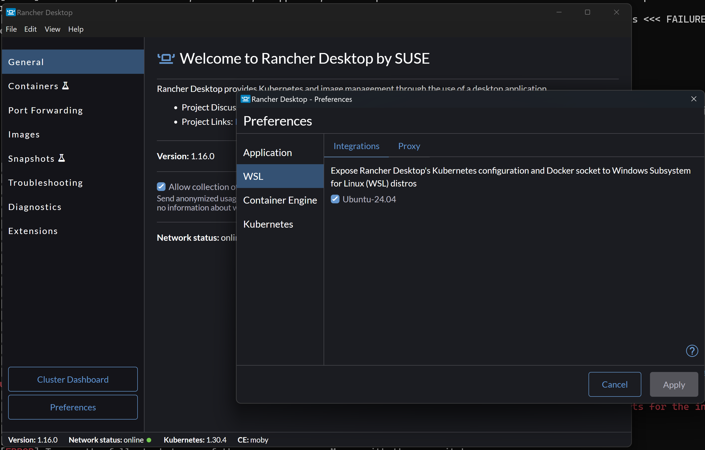

# Watsonx NeuroSymbolic Decision Framework

Welcome to the **watsonx-NeuroSymbolic-Decision** framework! This project provides a robust platform for integrating the generative power of Large Language Models (LLMs), particularly IBM's watsonx.ai, with the precision and explainability of symbolic reasoning systems, including rule engines and ontology reasoners.

The core idea is to create intelligent systems that leverage both the pattern-recognition strengths of neural networks (LLMs) and the logical deduction capabilities of symbolic AI. This framework facilitates building applications where:

1.  Natural language interactions (via LLMs) can drive complex decision-making processes.
2.  Symbolic knowledge (business rules, ontologies) grounds the LLM, ensuring accuracy, consistency, and compliance.
3.  Reasoning over structured knowledge enhances the LLM's understanding and response generation.

## Framework Architecture

The framework is an extension of [decision management project.](https://github.com/DecisionsDev/rule-based-llms), where we enables a flexible architecture where LLMs orchestrate interactions with various symbolic components. A typical flow involves:
1.  **User Interaction:** User poses a query in natural language via a frontend interface.
2.  **LLM Orchestration:** The core agent (powered by an LLM like watsonx.ai and potentially frameworks like Langchain) interprets the query.
3.  **Symbolic Component Identification:** The agent determines if the query requires symbolic reasoning (e.g., executing business rules, querying an ontology).
4.  **Parameter Extraction:** The LLM extracts necessary parameters from the user query for the symbolic component.
5.  **Symbolic Execution:** The agent invokes the appropriate component:
    * **Decision Service:** Executes business rules using engines like [IBM Operational Decision Manager (ODM)](https://www.ibm.com/products/operational-decision-manager) or [IBM Automation Decision Services (ADS)](https://www.ibm.com/products/automation-decision-services).
    * **Ontology Reasoner:** Performs logical deductions over an ontology (e.g., using OWL and reasoners like HermiT) to infer new knowledge or validate information.
    * *(Extensible for other symbolic systems)*
6.  **Response Generation:** The LLM uses the precise results from the symbolic component(s) to formulate an accurate and contextually relevant answer.


### Core Components

The repository includes reference implementations and tools:

* **`neuro-symbolic-agent`** (Formerly `rule-agent`): The Python backend orchestrating LLM interactions, symbolic component calls, and potentially housing reasoning logic. Built using Python and libraries like Langchain.
* **`symbolic-components`**: Examples of symbolic knowledge and execution engines:
    * `decision-services`: Sample ODM/ADS projects (e.g., HR Service).
    * `ontologies`: Sample OWL ontologies and configurations for reasoners.
* **`chatbot-frontend`**: A reference React web application demonstrating user interaction with the agent.

Detailed READMEs are available within each component's directory.

## Prerequisites

Ensure your system meets these requirements:

* **Operating System:** Tested on macOS (M1/Intel) and Windows 11 (using Rancher Desktop with WSL2).
* **Docker:** Required for the standard containerized deployment.
    * We recommend **Rancher Desktop** for easy setup:
        * [macOS Install](https://docs.rancherdesktop.io/getting-started/installation#macos)
        * [Windows Install](https://docs.rancherdesktop.io/getting-started/installation#windows)
    * Docker Desktop or Docker Engine are alternatives.
* **Docker Compose:** Typically included with Docker Desktop/Rancher Desktop. Verify with `docker compose version`.
* **Git:** For cloning the repository.
* **Python (Optional, for Local Development):** Python 3.11+ is needed if you plan to run or modify the `neuro-symbolic-agent` outside Docker. See [Local Python Environment Setup](#setting-up-a-local-python-development-environment-optional).

### Windows Specific Setup (WSL2)

1.  **Enable WSL2:** Install and enable the [Windows Subsystem for Linux (WSL2)](https://learn.microsoft.com/en-us/windows/wsl/install).
2.  **Configure Rancher Desktop:** Ensure Rancher Desktop uses the WSL2 backend:
    

---

## Setting Up Your LLM and Symbolic Environment

The framework is designed to be flexible. You can configure it with different LLMs and symbolic backends. The primary supported LLM is **IBM watsonx.ai**, but local models via **Ollama** are also supported for experimentation.

### Option 1: Setting up with Watsonx.ai (Recommended)

Leverage IBM's powerful cloud-based foundation models.

1.  **Set up IBM Watsonx.ai:**
    * **Account & Service:** Create an IBM Cloud account, set up Watsonx.ai, and instantiate the service. [Guide](https://dataplatform.cloud.ibm.com/docs/content/wsj/getting-started/overview-wx.html?context=wx&audience=wdp).
    * **API Key:** Generate an API key from your Watsonx console (`Profile and settings` -> `API key`). [Learn how](https://eu-gb.dataplatform.cloud.ibm.com/docs/content/wsj/admin/admin-apikeys.html?context=wx&audience=wdp). Note this key.
    * **Project & ID:** Create a project in Watsonx.ai ([Guide](https://dataplatform.cloud.ibm.com/docs/content/wsj/manage-data/manage-projects.html?context=wx&audience=wdp)) and note its Project ID (Manage tab -> General -> Details).
2.  **Clone the Repository:**
    ```bash
    # Replace with your actual repository URL
    git clone [https://github.com/ruslanmv/watsonx-NeuroSymbolic-Decision.git](https://github.com/ruslanmv/watsonx-NeuroSymbolic-Decision.git)
    cd watsonx-NeuroSymbolic-Decision
    ```
3.  **Configure Environment Variables:**
    * Copy the Watsonx.ai environment template:
        ```bash
        # Assuming the template is named watsonx.env
        cp watsonx.env .env
        ```
    * **Edit `.env`:** Fill in your Watsonx.ai credentials:
        * `WATSONX_APIKEY=<your watsonx.ai API Key>`
        * `WATSONX_PROJECT_ID=<your watsonx.ai Project ID>`
        * `WATSONX_URL=<your watsonx.ai region URL>` (e.g., `https://us-south.ml.cloud.ibm.com`)
        * *(Add any other relevant variables for symbolic components)*

Proceed to [Launch the Docker Topology](#launch-the-docker-topology).

### Option 2: Setting up with Ollama (Local Experimentation)

Run open-source LLMs locally. Suitable for development and testing without cloud dependencies.

1.  **Install Ollama:** Download and install from [ollama.ai/download](https://ollama.ai/download).
2.  **Download an LLM Model:** Pull a model compatible with the framework (e.g., `mistral`):
    ```bash
    ollama pull mistral
    ```
    * Ollama serves models at `http://localhost:11434`. Check [Ollama FAQ](https://github.com/ollama/ollama/blob/main/docs/faq.md#how-can-i-allow-additional-web-origins-to-access-ollama) for potential CORS issues with Docker.
3.  **Clone the Repository:**
    ```bash
    # Replace with your actual repository URL
    git clone [https://github.com/ruslanmv/watsonx-NeuroSymbolic-Decision.git](https://github.com/ruslanmv/watsonx-NeuroSymbolic-Decision.git)
    cd watsonx-NeuroSymbolic-Decision
    ```
4.  **Configure Environment Variables:**
    * Copy the Ollama environment template:
        ```bash
        # Assuming the template is named ollama.env
        cp ollama.env .env
        ```
    * Verify settings in `.env` (defaults usually work for Ollama).

Proceed to [Launch the Docker Topology](#launch-the-docker-topology).

---

## Launch the Docker Topology

With the environment configured (`.env` file ready) and the repository cloned, launch the application stack using Docker Compose.

1.  **Open Terminal:** Navigate to the `watsonx-NeuroSymbolic-Decision` directory. Use `wsl` on Windows if applicable.
2.  **Docker Login (Recommended):** Run `docker login` to avoid image pull rate limits.
3.  **Build Docker Images:**
    ```bash
    docker-compose build
    ```
4.  **Run the Application:**
    ```bash
    docker-compose up
    ```
    Wait for services (ODM/ADS Dev Edition, Neuro-Symbolic Agent, Frontend) to initialize.
5.  **Access the Application:** Open [http://localhost:8080](http://localhost:8080) in your browser.

---

## Using the Framework: Neuro-Symbolic Capabilities

The core strength of this framework lies in its ability to combine LLM flexibility with symbolic rigor.

* **Decision Service Integration:** As shown in the HR demo, the LLM can identify when a query maps to a predefined decision service (like ODM or ADS), extract parameters, invoke the service, and use the precise result. This ensures calculations and decisions adhere strictly to business rules. Configure which services are available via tool descriptors (see `symbolic-components/decision-services` examples and agent configuration).
* **Ontology-Based Reasoning:** The framework supports integrating OWL ontologies and reasoners (like HermiT, included in the reference agent).
    * **Knowledge Representation:** Define your domain concepts, properties, and relationships in an OWL ontology (`symbolic-components/ontologies`).
    * **Logical Form Mapping (Optional):** Implement or train models to map natural language queries to structured logical forms (SPARQL queries or other formal representations) that can be evaluated against the ontology.
    * **Reasoning:** The agent can load the ontology and use a reasoner to:
        * Infer implicit knowledge.
        * Check consistency.
        * Answer queries requiring logical deduction beyond simple lookups.
    * **Activation:** Configuration (e.g., environment variables like `USE_ONTOLOGY_REASONER=1` and paths to ontology files in `.env`) determines if and how ontology reasoning is used. Refer to the `neuro-symbolic-agent` documentation for specifics.
* **Extensibility:** The agent architecture allows adding connectors to other symbolic systems or knowledge bases.


---

## Extending the Framework

Adapt the framework for your specific use case:

1.  **Define Symbolic Knowledge:** Create your own decision services (ODM/ADS) or ontologies (OWL).
2.  **Configure Tools:** Create tool descriptors (`.json` files) for your decision services so the LLM agent knows how to use them. Configure ontology paths and reasoner settings.
3.  **Customize Prompts:** Adjust the prompts used by the LLM agent for tool selection, parameter extraction, and response generation.
4.  **Develop Frontend:** Modify or replace the reference `chatbot-frontend` as needed.
5.  **(Advanced) Add Connectors:** Extend the `neuro-symbolic-agent` to interact with other symbolic systems.

Refer to specific component READMEs and the [README_EXTEND.md](README_EXTEND.md) guide (if available/updated) for detailed instructions.

---

## Setting up a Local Python Development Environment (Optional)

For direct development on the `neuro-symbolic-agent`:

1.  **Install Python 3.11+:** Follow OS-specific instructions. (See previous README for Ubuntu example using `deadsnakes` PPA).
2.  **Create Virtual Environment:**
    ```bash
    # In the watsonx-NeuroSymbolic-Decision directory
    python3 -m venv .venv
    source .venv/bin/activate # (or .venv\Scripts\activate on Windows)
    ```
3.  **Install Dependencies:**
    ```bash
    pip install --upgrade pip
    # Navigate to neuro-symbolic-agent directory if requirements are there
    # cd neuro-symbolic-agent
    pip install -r requirements.txt
    ```
4.  **Set Environment Variables:** Ensure all necessary variables from your `.env` file (API keys, URLs, paths) are available in your local shell environment.

---

## FAQ / Troubleshooting

* **Docker Error 137 (Memory):** Increase Docker's allocated memory. Run `docker system prune -a` to clean up resources.
* **`docker-compose: command not found`:** Use `docker compose` (space instead of hyphen).
* **Ontology Reasoner Issues:** Verify Java installation (required by some reasoners like HermiT). Check ontology file paths and format. Consult `neuro-symbolic-agent` logs.